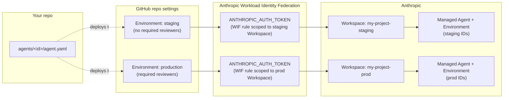
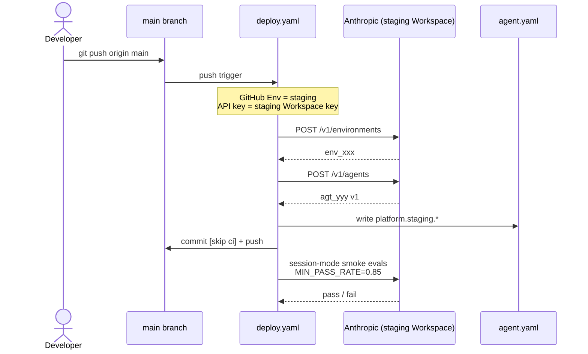
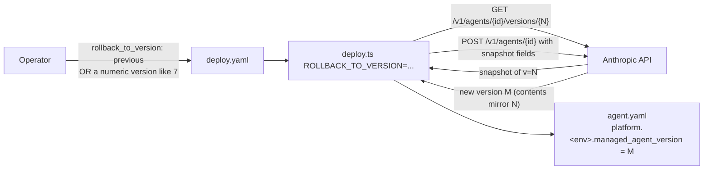

# Deploy and promote — the map

How an agent change in this repo travels from a PR all the way to a production
Managed Agent. One-page reference with diagrams; deep links into the existing
docs where relevant.

- [docs/managed-agents.md](managed-agents.md) — what each Anthropic primitive is
- [docs/workspaces.md](workspaces.md) — why each environment needs its own Workspace
- [docs/credentials.md](credentials.md) — how `ANTHROPIC_API_KEY` gets provisioned per environment

## Topology (one-time setup)



**Setup checklist** (do once per project):

1. **Anthropic Console** → create Workspaces: `my-project-staging`, `my-project-prod`. Set `data_residency` at create time — it's immutable.
2. **Anthropic Console** → create a service account (one for CI) and one Workload Identity Federation rule per Workspace. See [docs/credentials.md](credentials.md) for the rule shape.
3. **GitHub repo settings → Environments** → create `staging` and `production`. On `production`, require reviewers and restrict to `main`.
4. **GitHub variables** → set repo-level `vars.ANTHROPIC_ORGANIZATION_ID` and `vars.ANTHROPIC_SERVICE_ACCOUNT_ID`, then per-environment `vars.ANTHROPIC_FEDERATION_RULE_ID` and `vars.ANTHROPIC_WORKSPACE_ID`.
5. **Sanity check** — run the staging deploy and confirm the agent lands in the right Workspace before promoting to production.

> Steps 1 and 2 are the only Console-side admin work. Everything below — creating Managed Agents, creating Managed Agents Environments, running smoke-eval Sessions — uses the workspace-scoped WIF token minted at job start. The pipeline never needs an admin key.

## Path 1 — Auto-deploy to staging on merge to `main`



What lands where:

| Resource                   | Where it ends up                                                                                                                                 |
| -------------------------- | ------------------------------------------------------------------------------------------------------------------------------------------------ |
| Managed Agents Environment | created in staging Workspace; ID written to `platform.staging.managed_environment_id`                                                            |
| Managed Agent              | created in staging Workspace; ID + version written to `platform.staging.managed_agent_id` / `platform.staging.managed_agent_version`             |
| Smoke evals                | run as real `/v1/sessions` against the just-shipped version; fail the job (and block the deploy from being considered "good") if pass rate < 85% |

Re-runs are idempotent — the next push reads the existing IDs from `platform.staging.*`, calls `POST /v1/agents/{id}` with current fields, and the API auto-bumps the version (or returns the same version unchanged if nothing diffed).

## Path 2 — Promote staging → production

```mermaid
sequenceDiagram
    actor Op as Operator
    participant UI as Actions → Deploy → Run
    participant Reviewer as Required reviewer
    participant GHA as deploy.yaml
    participant Prod as Anthropic (prod Workspace)
    participant YAML as agent.yaml

    Op->>UI: environment=production<br/>agent=&lt;blank or id&gt;
    UI->>Reviewer: gate on production environment
    Reviewer-->>UI: approve
    UI->>GHA: start
    Note over GHA: GitHub Env = production<br/>API key = prod Workspace key
    GHA->>Prod: POST /v1/environments
    Prod-->>GHA: env_aaa  (NEW; not the staging env_xxx)
    GHA->>Prod: POST /v1/agents
    Prod-->>GHA: agt_bbb v1  (NEW; not the staging agt_yyy)
    GHA->>YAML: write platform.production.*
    GHA->>Repo: commit + push
    GHA->>Prod: session-mode smoke evals<br/>MIN_PASS_RATE=0.95
    alt evals fail
      Note over GHA: auto-rollback fires
      GHA->>Prod: deploy.ts ROLLBACK_TO_VERSION=previous
      Prod-->>GHA: restored as a new mirror version
    end
```

**Important:** there is no "promote" API call. Promotion is just _running the same script in a different Workspace_. The production Agent and production Managed Agents Environment are **separate resources** from the staging ones (different Workspaces; resources can't cross Workspace boundaries) — that's why each environment has its own block under `platform:` in agent.yaml.

The system prompt, model, tools, and `environment` config sent to prod are read from the same `agent.yaml` that staging used. So "what staging tested" and "what prod runs" are byte-equivalent on the source side, even though the server-assigned IDs and version numbers differ.

The pass-rate threshold is intentionally tighter for prod (`0.95` vs staging's `0.85`) — see [deploy.yaml](.github/workflows/deploy.yaml).

## Path 3 — Rollback

Two flavors, both trigger via **Actions → Deploy → Run workflow** with the
`rollback_to_version` input:



Versions are append-only — Anthropic doesn't let you "delete" versions. A
rollback creates a _new_ version whose contents mirror an earlier one.
"`previous`" resolves to _current version − 1_, per agent.

This rollback path also fires automatically on `production` deploys when the
post-deploy session-mode evals fail — see [deploy.yaml](.github/workflows/deploy.yaml).

## What `agent.yaml` looks like across the lifecycle

Before the first deploy:

```yaml
platform:
  staging:
    managed_agent_id: null
    managed_agent_version: null
    managed_environment_id: null
  production:
    managed_agent_id: null
    managed_agent_version: null
    managed_environment_id: null
```

After staging deploys for the first time:

```yaml
platform:
  staging:
    managed_agent_id: agt_yyy
    managed_agent_version: 1
    managed_environment_id: env_xxx
  production:
    managed_agent_id: null
    managed_agent_version: null
    managed_environment_id: null
```

After production promotion:

```yaml
platform:
  staging:
    managed_agent_id: agt_yyy
    managed_agent_version: 4 # has bumped a few times by now
    managed_environment_id: env_xxx
  production:
    managed_agent_id: agt_bbb # different ID — different Workspace
    managed_agent_version: 1
    managed_environment_id: env_aaa # different ID too
```

## Deploy controls cheat sheet

| You want to…                                 | Trigger                                                                                          |
| -------------------------------------------- | ------------------------------------------------------------------------------------------------ |
| Ship every PR-merged change to staging       | nothing — happens automatically on push to `main`                                                |
| Promote the current `main` to production     | Actions → **Deploy** → Run workflow, set `environment=production`                                |
| Deploy a specific agent only                 | Same, set `agent=<agent-id>`                                                                     |
| Roll production back to the previous version | Actions → **Deploy** → Run workflow, `environment=production`, `rollback_to_version=previous`    |
| Roll production back to an exact version     | Same, `rollback_to_version=7` (or whatever)                                                      |
| Pause auto-deploys                           | Disable the **Deploy** workflow in the Actions tab, or revoke the staging API key in the Console |

## Troubleshooting

| Symptom                                                                           | Likely cause                                                                                                                                                                                                                               |
| --------------------------------------------------------------------------------- | ------------------------------------------------------------------------------------------------------------------------------------------------------------------------------------------------------------------------------------------ |
| Deploy succeeds but session-mode evals 404 on `agt_…`                             | The WIF token CI minted is scoped to a different Workspace than the one the agent lives in. Re-check `vars.ANTHROPIC_FEDERATION_RULE_ID` and `vars.ANTHROPIC_WORKSPACE_ID` on that GitHub Environment.                                      |
| `platform.<env>.managed_agent_id` keeps churning to a different ID across deploys | Something is clearing the YAML between runs (e.g. a `.gitignore` rule on `agent.yaml`, or `commit-platform-ids` is failing silently). Check the deploy logs.                                                                               |
| Production deploy auto-rolled back without my asking                              | Smoke evals (`MIN_PASS_RATE=0.95`) failed. The previous version is now live; check `.eval-results/` artifacts for the failing cases.                                                                                                       |
| Need to change the Managed Agents Environment (packages, networking)              | Bump `environment.name` in `agent.yaml` to a new unique value — Anthropic's environment objects aren't versioned, so a name change forces a fresh `POST /v1/environments` on the next deploy. The old one stays live until you archive it. |
| First-ever deploy succeeded but commit-back failed                                | The `commit-platform-ids` step pushed via `GITHUB_TOKEN`; protected branches reject it. Either turn that step off and commit the IDs by hand, or use a PAT in `secrets.PIPELINE_PUSH_TOKEN` and tweak the workflow.                        |
